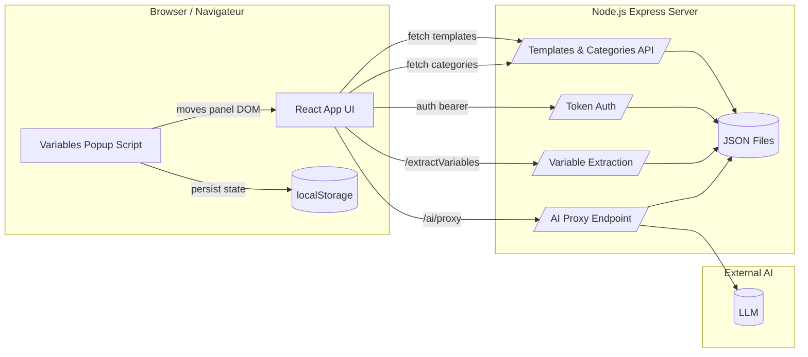
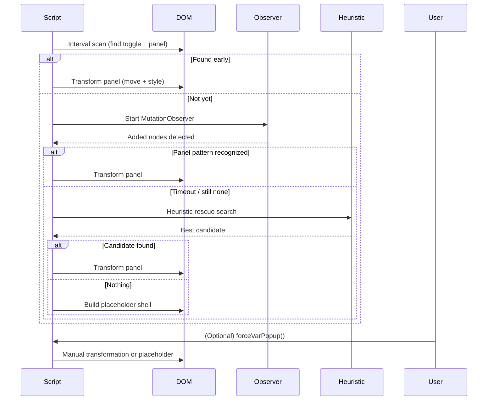
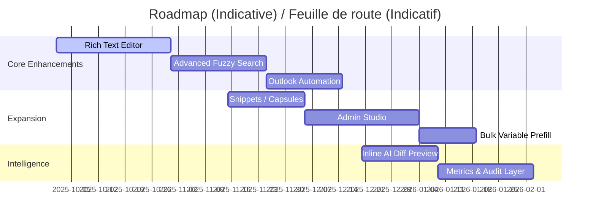
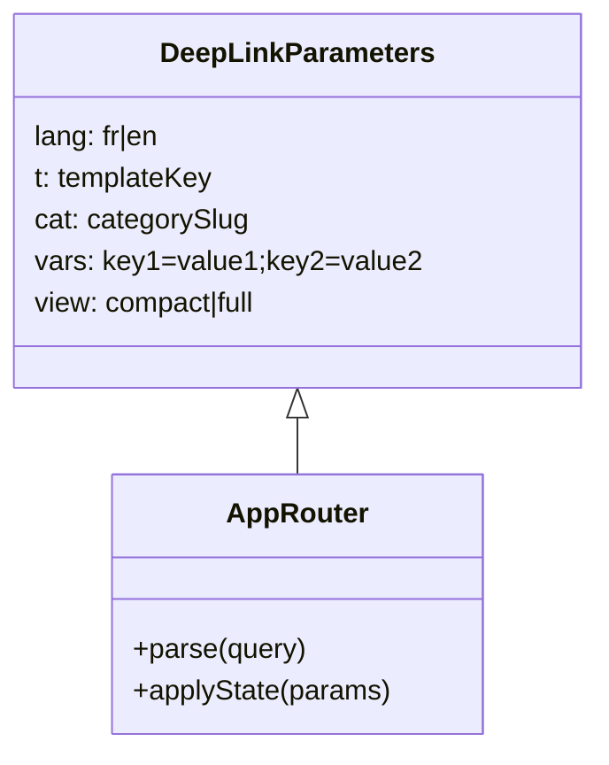

# Visual Diagrams / Diagrammes Visuels

Mermaid-based diagrams (renderable in many markdown viewers or via extensions). EN + FR captions.

## 1. High-Level Architecture / Architecture Haut Niveau


**EN:** The browser hosts the reactive app. The popup script augments UI post-render without breaking event bindings. Server supplies template/category data, variable parsing, token auth, and an AI proxy isolating the external key.  
**FR:** Le navigateur héberge l’application réactive. Le script du panneau ajoute la couche flottante sans casser les événements. Le serveur fournit données, extraction, authentification et un proxy IA protégeant la clé.

---
## 2. Variables Panel Detection Lifecycle / Cycle de Détection du Panneau des Variables


**EN:** Multi-layer fallback prevents user confusion if late hydration or structural shifts occur.  
**FR:** Strates multiples évitent la confusion utilisateur en cas d’hydratation tardive ou de structure variable.

---
## 3. Magnetic Snap Behavior / Comportement d’Enclenchement Magnétique
```mermaid
flowchart TD
  A[User drags panel upward] --> B{Panel top < Banner bottom?}
  B -- No --> C[Free movement]
  B -- Yes --> D{Within leeway (≤100px above)?}
  D -- Yes --> E[Allow temporary overlap]
  E --> F[Mouseup]
  F --> G[Animate snap to boundary]
  D -- No --> H[Clamp immediately]
  H --> G
```

**EN:** Panel can float into a tolerance band for spatial feedback; release triggers smooth snap.  
**FR:** Le panneau peut entrer dans la zone tolérée; au relâchement il s’aligne doucement.

---
## 4. Roadmap Evolution Overview / Vue d’Ensemble de l’Évolution Planifiée


**EN:** Indicative sequence, real delivery may reorder based on impact / dependency.  
**FR:** Séquence indicative; l’ordre réel peut changer selon impacts et dépendances.

---
## 5. Deep Link Concept / Concept de Lien Profond


**EN:** A minimal param grammar enables shareable, reproducible UI states.  
**FR:** Une grammaire de paramètres minimale permet des états d’interface partageables et reproductibles.

---
*Document version:* 1.0  (Script v1.5.3)
